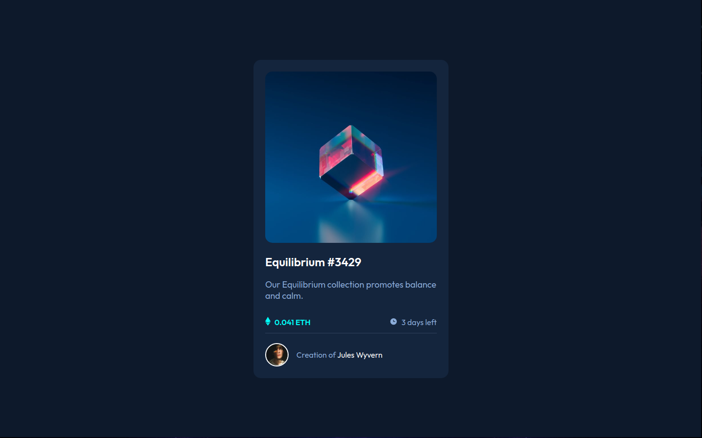
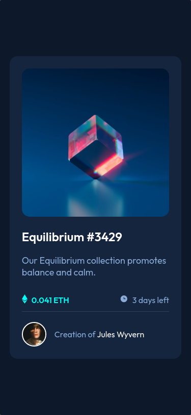

# Frontend Mentor - Solução de componente de cartão de visualização NFT

Esta é uma solução para o [desafio do componente de cartão de visualização NFT no Frontend Mentor](https://www.frontendmentor.io/challenges/nft-preview-card-component-SbdUL_w0U). Os desafios do Frontend Mentor ajudam você a melhorar suas habilidades de codificação criando projetos realistas.

## Visão geral

### O desafio

Os usuários devem ser capazes de

- Veja o layout ideal dependendo do tamanho da tela do dispositivo
- Veja os estados de foco para elementos interativos

### Captura de tela

**Desktop**



**Mobile**

Adicione uma captura de tela da sua solução. A maneira mais fácil de fazer isso é usar o Firefox para visualizar seu projeto, clicar com o botão direito do mouse na página e selecionar "Fazer uma captura de tela". Você pode escolher uma captura de tela de altura total ou uma cortada com base no tamanho da página. Se for muito longo, talvez seja melhor cortá-lo.

### Links

- **STATUS/ON** Live Site URL: [See in real time on vercel](https://nft-card-component-npz4l9cut-henriquessan.vercel.app/)

## Meu Processo

### Construido Com

- Semantic HTML5 markup.
- CSS custom properties.
- SCSS(SASS) custom properties.
- CSS Methodology BEM.
- Flexbox.
- Mobile-first workflow.

### O que eu aprendi

```html
<h1>Some HTML code I'm proud of</h1>
```

```css
.proud-of-this-css {
  color: papayawhip;
}
```

```js
const proudOfThisFunc = () => {
  console.log('🎉')
}
```

### Desenvolvimento contínuo

Use esta seção para delinear as áreas nas quais você deseja continuar focando em projetos futuros. Estes podem ser conceitos com os quais você ainda não está completamente confortável ou técnicas que você achou úteis que você deseja refinar e aperfeiçoar.


### Useful resources

- [Video de como usar o SASS BR](https://www.youtube.com/watch?v=C8KlabGtE8Y) - Aprendi com esse video como usar o basico do pré-processador Sass(Scss) em projetos
- [CSS Methodology BEM](https://www.youtube.com/watch?v=27JtRAI3QO8) - Aprendi Uma melhor forma de criar classes com esta metodologia para tornar o codigo mais legível e limpo possível
- [CSS Artigo de Metodologia BEM](https://css-tricks.com/bem-101/) - Artigo sobre a metodologia BEM foi um complementar

## Autor

- Linkedin - [Henrique Santos Santana](https://www.linkedin.com/in/henrique-santos-santana/)
- Frontend Mentor - [@HenriqueSSan](https://www.frontendmentor.io/profile/HenriqueSSan)
- Vercel - [HenriqueSSan](https://vercel.com/henriquessan)

## Agradecimentos

É aqui que você pode dar uma dica de chapéu para quem o ajudou neste projeto. Talvez você tenha trabalhado em equipe ou tenha se inspirado na solução de outra pessoa. Este é o lugar perfeito para dar-lhes algum crédito.
