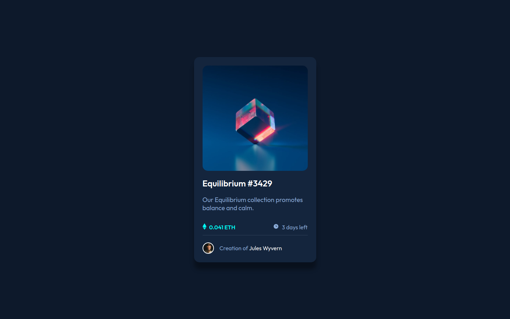

# Frontend Mentor - Solução de componente de cartão de visualização NFT

Esta é uma solução para o [desafio do componente de cartão de visualização NFT no Frontend Mentor](https://www.frontendmentor.io/challenges/nft-preview-card-component-SbdUL_w0U). Os desafios do Frontend Mentor ajudam você a melhorar suas habilidades de codificação criando projetos realistas.

## Visão geral

### O desafio

Os usuários devem ser capazes de

- Veja o layout ideal dependendo do tamanho da tela do dispositivo
- Veja os estados de foco para elementos interativos

- Desafio proprio:
  - Não pode usar Media Queries

### Captura de tela

**Desktop**

**Mobile**

Adicione uma captura de tela da sua solução. A maneira mais fácil de fazer isso é usar o Firefox para visualizar seu projeto, clicar com o botão direito do mouse na página e selecionar "Fazer uma captura de tela". Você pode escolher uma captura de tela de altura total ou uma cortada com base no tamanho da página. Se for muito longo, talvez seja melhor cortá-lo.

### Links

- **STATUS/ON** Ao vivo Site URL: [Veja o Projeto na Vercel](https://nft-card-component-npz4l9cut-henriquessan.vercel.app/)

## Meu Processo

### Construido Com

- Semantic HTML5 markup.
- CSS custom properties.
- SCSS(SASS) custom properties.
- CSS Methodology BEM.
- Flexbox.
- Mobile-first workflow.

### O que eu aprendi

Como Construir um projeto de forma organizada e com boas praticas, As dificuldades que tive foi de propor para mim mesmo em criar ele responsivo sem a utilização de media queries, e assim fiz percebi que a minha estrutura do HTML5 não estava bom e foi procurar maneiras de estrutura-lo melhor, Crie o projeto em Sass(Ultilizando um recompilador que recompilava o meu código e "Traduzia" para Css) tive que procurar isso porque eu não queria ter que instalar um Framework ou o Npm para isso então fui procurar uma maneira e achei, A utilização do Sass não foi um problema porque eu já tinha entendido no videos e ajudou bastante e acelerou meu desenvolvimento.

A Organização do Pojeto foi:

- Primeiro a estrutura HTML5 com boas práticas
- Criação de classes de forma mais clara
- Criação do layout em CSS
- Adicionando responsividade
- Animações em CSS

### Desenvolvimento contínuo

Pretendo Melhorar meu CSS e HTML e desenvolver projetos em JavaScript, CSS reduzir a utilização de classes desnecesarias e HTML desenvolver estruturas mais eficientes e melhores,

### Recursos úteis

- [Video de como usar o SASS BR](https://www.youtube.com/watch?v=C8KlabGtE8Y) - Aprendi com esse video como usar o basico do pré-processador Sass(Scss) em projetos
- [CSS Methodology BEM](https://www.youtube.com/watch?v=27JtRAI3QO8) - Aprendi Uma melhor forma de criar classes com esta metodologia para tornar o codigo mais legível e limpo possível
- [CSS Artigo de Metodologia BEM](https://css-tricks.com/bem-101/) - Artigo sobre a metodologia BEM foi um complementar

## Autor

- Linkedin - [Henrique Santos Santana](https://www.linkedin.com/in/henrique-santos-santana/)
- Frontend Mentor - [@HenriqueSSan](https://www.frontendmentor.io/profile/HenriqueSSan)
- Vercel - [HenriqueSSan](https://vercel.com/henriquessan)

## Agradecimentos

Agradeço aqueles que estão vendo esse projeto e meu desenvolvimento tenham um bom dia 
